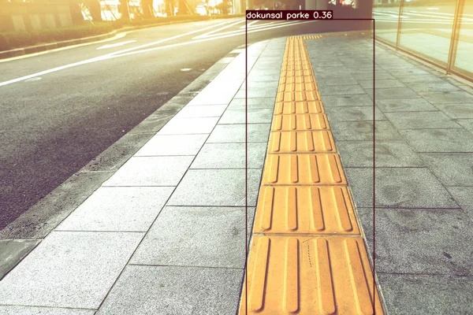

|**ÖZET** Görme engelli bireylerin hayatlarında çok önemli bir yere sahip olan dokunsal parkeler onlara dışarıda yol göstermelerine yardımcı olmaktadır. Dokunsal parkeleri tespit etme ile ilgili Ek’te sunulan makaleden esinlenerek Yolov3 ile yapılmış olan dokunsal parke tespiti adlı çalışma Yolov7 ile yapmaya çalışılmıştır. Google üzerinden indirmiş olduğum dokunsal parke yüzeyi fotoğraflarını https://www.makesense.ai/ adresinden etiketleme yaparak etiketlemiş olduğum fotoğrafları https://app.roboflow.com/aatay-korkut/parke/6 roboflow sitesine yükledim. Roboflow sitesinde tüm resimleri tek boyut 640x640 olarak ayarladım. Yolov7'ye uygun olarak export etmiş olduğum kodu Colab'a yazarak etiketlenmiş verilerin indirilmesi sağlanmıştır. Daha sonra Yolov7 ile nesne tespiti yapılmıştır. |
| - |

|
from google.colab import drive drive.mount('/content/drive')

Öncelikle bu kodla Google Drive'ımıza bağlanarak yapılan projenin Drive'a kayıt edilmesi sağlanıyor.

|
| :- |

|
%cd /content/drive/MyDrive

Kendi Drive'ımızın içine giriyoruz.

|
| :- |

|
!git clone https://github.com/WongKinYiu/yolov7 %cd yolov7 !pip install -r requirements.txt

Kendi Drive'ımıza yolov7 dosyalarını indiriyoruz.

|
| :- |

|
` `Google üzerinden indirmiş olduğum dokunsal parke yüzeyi fotoğraflarını https://www.makesense.ai/ adresinden etiketleme yaparak etiketlemiş olduğum fotoğrafları https://app.roboflow.com/aatay-korkut/parke/6 roboflow sitesine yükledim. Roboflow sitesinde tüm resimleri tek boyut 640x640 olarak ayarladım. Yolov7'ye uygun olarak export etmiş olduğum kodu Colab'a yazarak etiketlenmiş verilerin indirilmesini sağladım.

!pip install roboflow

from roboflow import Roboflow rf = Roboflow(api\_key="4mJUxp0WmwZDKXKo1A9u") project = rf.workspace("aatay-korkut").project("parke") dataset = project.version(6).download("yolov7")

|
| - |

|Verilerimizi indirdikten sonra yolov7 klasörü içine yolov7.pt dosyasını indiriyoruz. %cd /content/yolov7 !wget "<https://github.com/WongKinYiu/yolov7/releases/download/v0.1/yolov7.pt>"|
| :- |

|
Yolov7.pt dosyasını indirdikten sonra eğitim işlemini başlatmak için aşağıdaki kodu yazıyoruz. Epochs değeri öğrenme sayısını vermektedir. Kodu çalıştırdığımız zaman yolov7 klasörü içinde train.py dosyasını çalıştırarak 200 öğrenme gerçekleştirecek.

 %cd /content/drive/MyDrive/yolov7/yolov7 !python train.py --batch 16 --cfg cfg/training/yolov7.yaml --epochs 200 --data {dataset.location}/data.yaml --weights 'yolov7.pt' --device 0
|
| :- |

Aşağıda gördüğümüz değerleri 200 epoch bittikten sonra görebiliriz. 1 epoch tamamlanma süresi 6 saniyedir. 200 epoch sonucunda bize vermiş olduğu en iyi modeli (best.pt) kullanılarak etiketleme gerçekleştireceğiz.

200 epochs completed in 0.555 hours.

Optimizer stripped from runs/train/exp/weights/last.pt, 74.8MB
Optimizer stripped from runs/train/exp/weights/best.pt, 74.8MB

|
Etiketleme yapabilmek için aşağıdaki kodu kullanmalıyız. Etiketlemek istediğimiz fotoğrafı Colab ortamına atarak fotoğrafa sağ tıklayıp yolu kopyaladıktan sonra source kısmına yapıştırıp kodumuzu çalıştırıyoruz.

!python detect.py --weights /content/drive/MyDrive/yolov7/yolov7/runs/train/exp/weights/best.pt --conf 0.1 --source /content/hissedilebilir-yuzey.jpg

|
| :- |

Aşağıda görüldüğü gibi kodumuz çalıştı ve fotoğrafta bizim istediğimiz etiketlemeyi yaptı. Etiketleme yapılan fotoğrafı görmek için yolov7/runs/detect/exp12/hissedilebilir-yuzey.jpg dosyasına erişerek etiketleme yüzdesi görülebilir.

model is traced!

1 dokunsal parke, Done. (18.4ms) Inference, (1.4ms) NMS
The image with the result is saved in: runs/detect/exp12/hissedilebilir-yuzey.jpg
Done. (0.216s)

